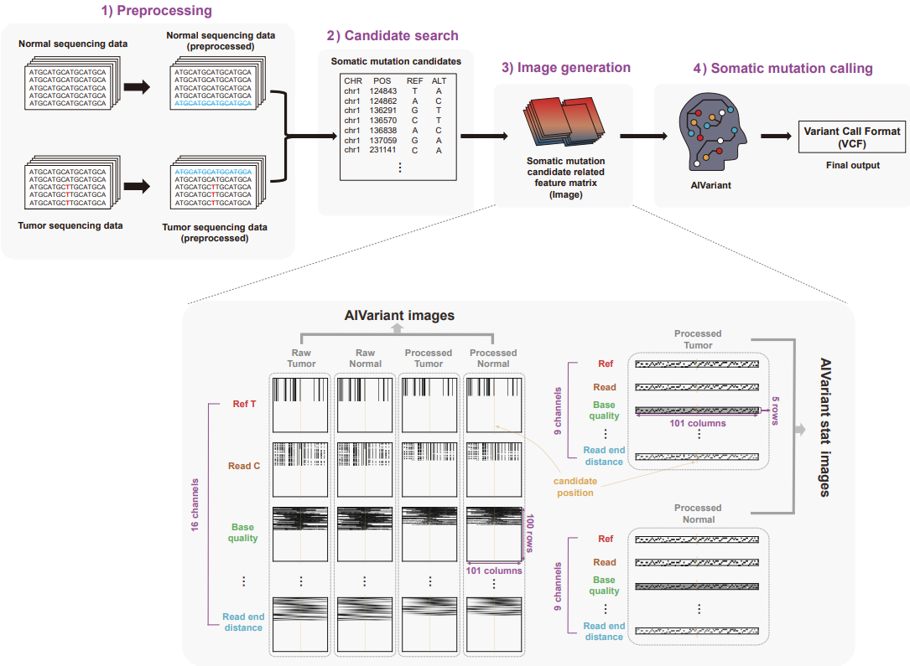

# AIVariant: a deeplearning based somatic variant detector for highly contaminated tumor samples

## Publication
Please cite "".

## Workflow


## Requirements
Need two separate virtual environment for the input generation and the evaluation of AIVariant 
due to the confiliting packages and the version requirements!!!

AIVariant input generation environment
```
conda create {input environment name}
conda activate {input environment name} 
conda install python=3.6.9 numpy -c condaforge
conda install samtools=1.9 -c bioconda
pip install pysam==0.11.2.2 pyBigWig==0.3.17 liftover==1.1.14 
```

AIVariant evaluation environment
```
conda create {evaluation environment name}
conda activate {evaluation environment name}
# Follow the instruction in https://www.tensorflow.org/ to install tensorflow >= 2.9
```

## AIVariant download
```
git clone https://github.com/Genome4me/AIVariant.git
```

You should also download the necessary epigenetic data files:
```
#Run the following commands inside the git cloned directory
wget https://www.encodeproject.org/files/ENCFF338EDE/@@download/ENCFF338EDE.bigWig -O ./AIVariant/bin/encode/pvals/H3K9me3_HepG2.bigWig
wget https://www.encodeproject.org/files/ENCFF881LOL/@@download/ENCFF881LOL.bigWig -O ./AIVariant/bin/encode/folds/H3K9me3_HepG2.bigWig
```

## Usage 
Before running the provided shell script, CONDA_PREFIX environment variable should be set to base conda path:
```
>$CONDA_PREFIX
```
above should return **~/anaconda3** or **~/miniconda**, if not then set the environment variable.

Example usage:
```
#Run the following commands inside the git cloned directory
cd AIVariant
bash run.sh -i {input environment name} -e {evaluation environment name} -t {tumor BAM file path} -n {normal BAM file path} -r {reference FASTA file path} -g {hg19 or hg38 depends on the reference} -o {output directory path} -d {estimated depth of input bam files}
```

or if you have multiple gpus and want to specify the gpu id:
```
#Run the following commands inside the git cloned directory
cd AIVariant
CUDA_VISIBLE_DEVICES={gpu id} bash run.sh -i {input environment name} -e {evaluation environment name} -t {tumor BAM file path} -n {normal BAM file path} -r {reference FASTA file path} -g {hg19 or hg38 depends on the reference} -o {output directory path} -d {estimated depth of input bam files}
```


## License
<a rel="license" href="http://creativecommons.org/licenses/by-nc-sa/4.0/"></a><br />This work is licensed under a <a rel="license" href="http://creativecommons.org/licenses/by-nc-sa/4.0/">Creative Commons Attribution-NonCommercial-ShareAlike 4.0 International License</a>.